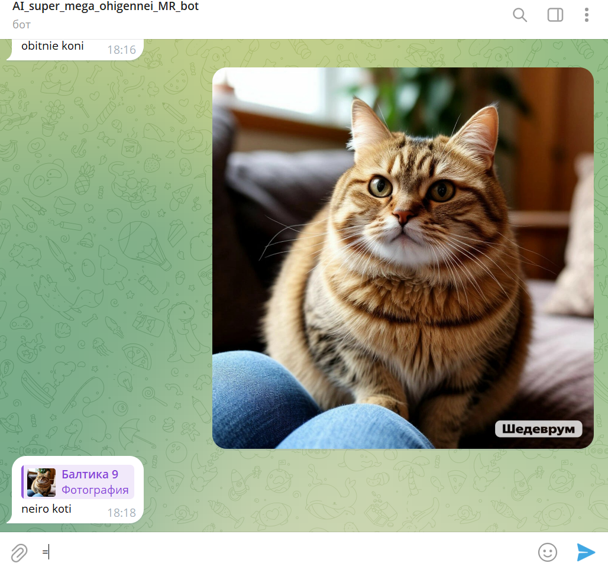
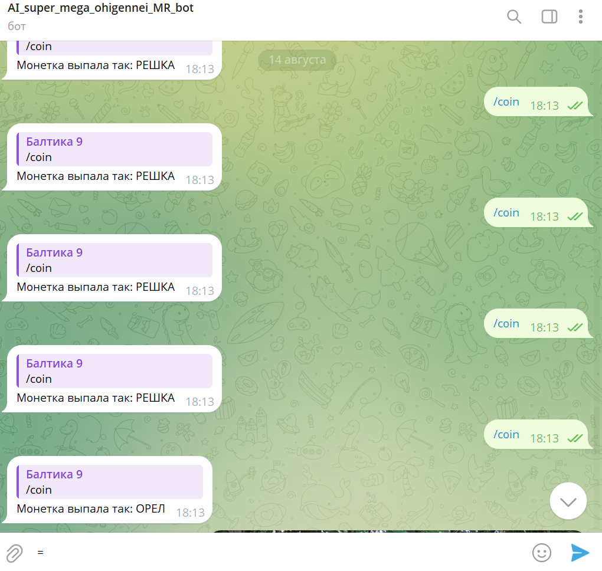
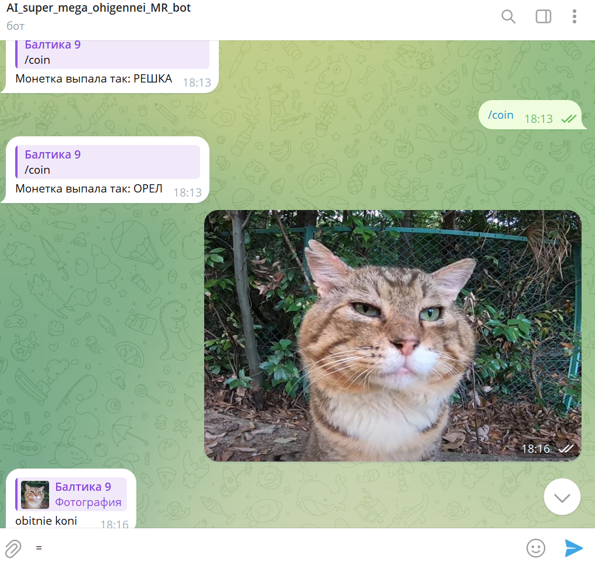
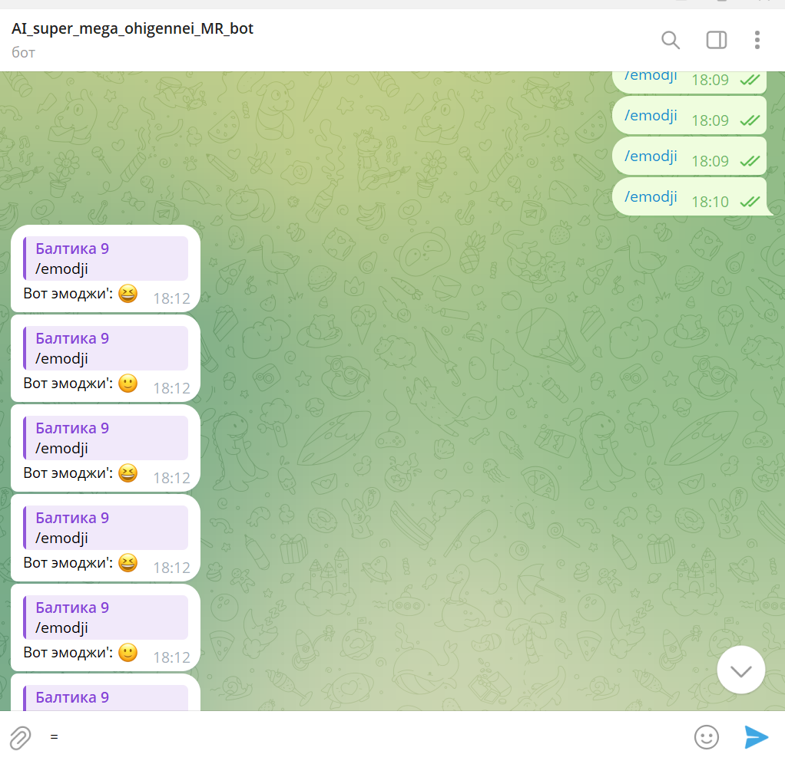

# top_bot

## Привет!

Привет!Это мой 2 бот и вот его функции:start;hello;bye;pass:emodji;photo;coin
start:базовая команда для приветствия пользователя
hello:приветствие
bye:прощание
pass:делает пароль из 10 символов
emodji:выдаёт случайный эмоджи
coin:выдаёт случайную сторону монеты решку или орла
photo:скидываешь фото кота и отвечет это кот или нейрокот(obitnie koni-это обычные коты;neiro koti-это коты сделаные нейросетью)

